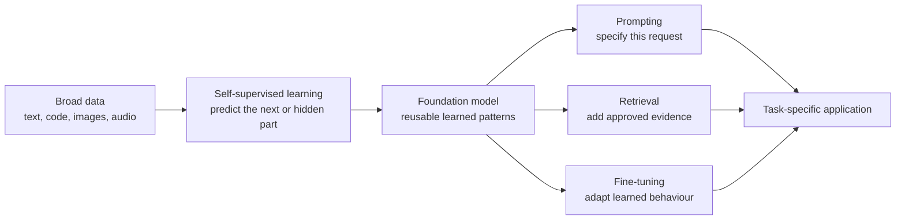
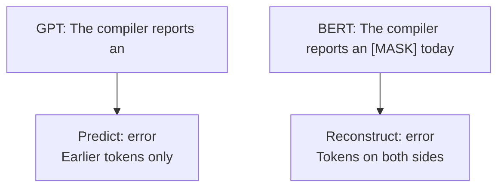
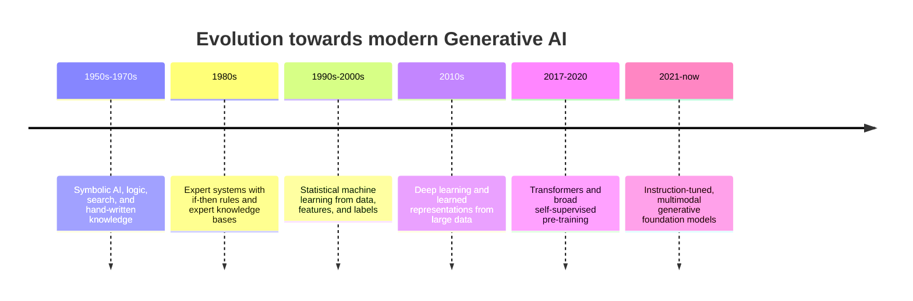
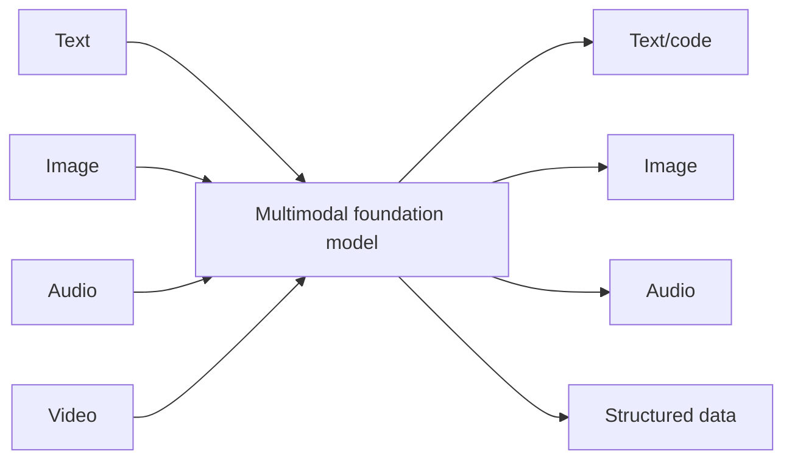
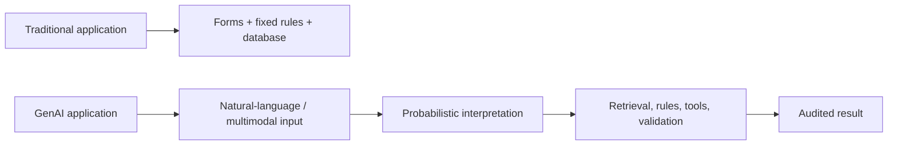
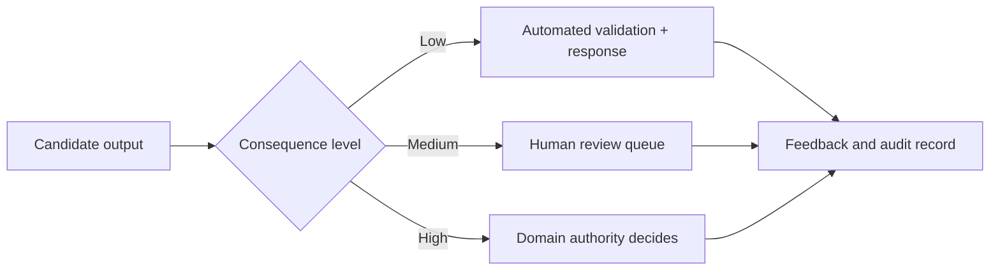

# Introduction to Generative AI

**Poster topic:** Evolution, applications, and real-world impact  
**Audience:** Engineering-college faculty  
**Suggested duration:** 35–45 minutes

## Narrative route

```text
Generative AI creates new content
        ↓
It needs a model that has learned broad patterns
        ↓
That model is called a foundation model
        ↓
Foundation models are adapted for a task
        ↓
An application adds data, tools, validation, and human authority
```

The slide order follows this route. Each slide starts by answering the question raised by the slide before it.

---

## Slide 1 — What is Generative AI?

### On slide

> **Modern Generative AI uses foundation models (large language models) pre-trained on broad data—to learn patterns and generate new synthetic content from an input or condition.**

Typical outputs:

- text and code;
- images, audio, and video;
- structured data such as JSON;
- transformed content such as summaries, translations, and reformatted documents.

```text
Broad data → pre-trained foundation model → task-specific Generative AI application
```

### Speaker notes

The word _generative_ means that the system produces a new sample rather than only assigning a label to an existing sample. A text model can continue an input sequence; an image model can create an image from a textual condition; a structured-output model can create a new JSON record from an unstructured document.

Before introducing foundation models, separate three independent ideas: **objective** (generate or decide), **architecture** (CNN, RNN/LSTM, Transformer), and **training/reuse paradigm** (foundation model). Generative AI predates foundation models: autoregressive RNNs/LSTMs, VAEs, GANs, and sequence-to-sequence models can all generate new samples.

## Slide 2 — What makes a model generative?

### On slide

- **Objective:** Generative AI creates a new sample; discriminative AI predicts a label, score, or value. An LSTM can continue `The cat…` or return `positive`, depending on its training objective.

- **Architecture:** CNN, RNN/LSTM, and Transformer describe how a model is built. Architecture alone does not decide whether the model is generative or discriminative.

- **Foundation-model paradigm:** A foundation model is broadly self-supervised pre-trained, then adapted across many tasks. LSTMs and GANs could be generative long before foundation models.

### Speaker notes

The architecture does not decide whether a model is generative. An LSTM trained to predict the next word is generative; the same LSTM trained for sentiment classification is discriminative. Foundation models add a third idea: broad self-supervised pre-training for reuse. They are the dominant modern approach to broad generative capability, not a synonym for Generative AI.

## Slide 3 — What is a Foundation Model?

### On slide

> A **foundation model** is a model trained on broad data, usually using self-supervised learning, that can be adapted to many downstream tasks.



**The key idea:** the raw data supplies the learning signal; people do not need to label every training example.

A foundation model is called **foundation** because it provides a broadly pre-trained base that can support many downstream applications through adaptation. It is a base capability, not yet a complete application.

### Self-supervised learning

> **Self-supervised learning** trains a model using targets derived from the data itself, rather than relying on a human-provided label for every example.

| Training data                          | Training task created from that data                                                                      |
| -------------------------------------- | --------------------------------------------------------------------------------------------------------- |
| Text: “The compiler reports an error.” | Predict the next token, or reconstruct a hidden token.                                                    |
| Image                                  | Reconstruct a missing or corrupted region, or learn whether two augmented views came from the same image. |
| Audio                                  | Predict a masked audio segment or its representation from surrounding sound.                              |

For a GPT-style language model, the earlier tokens are the input and the next token is the target. Repeating this across very large corpora lets the model learn broad statistical patterns without manually labelling every sentence.

GPT’s causal objective supports left-to-right text generation. BERT’s masked-token objective learns bidirectional representations that are especially useful for classification, search, and extraction.



### Speaker notes

Modern Generative AI is usually built on foundation models. They are called “foundation” models because self-supervised learning on broad data creates a reusable base that can be adapted for many downstream applications, rather than training a separate model from scratch for each task. A chat product, coding assistant, or document-processing tool adapts that base to a particular job. The next question is how this changed the way AI systems are developed.

---

## Slide 4 — From task-specific AI to Foundation Models

### On slide

> **The evolution is a shift in the unit of development:** from building one model for one labelled task to adapting one broadly pre-trained model for many tasks.



The major shift:

> From **one labelled dataset + one task-specific model**  
> to **broad pre-training + adaptation for many tasks**.

| Era | Technical approach | Representative systems | Limitation / transition |
| --- | --- | --- | --- |
| Symbolic AI (1950s–1970s) | Explicit logic, search, and hand-written knowledge | Logic Theorist; General Problem Solver | Transparent, but brittle outside encoded knowledge |
| Expert systems (1980s) | If-then rules plus an expert knowledge base | MYCIN; XCON/R1 | Knowledge capture and maintenance did not scale |
| Statistical ML (1990s–2000s) | Prediction from labelled data and engineered features | HMMs; decision trees; SVMs | A separate model and feature pipeline were needed for each task |
| Deep learning (2010s) | Multi-layer neural networks learned representations directly from data | AlexNet; LSTM sequence-to-sequence models | High data/compute demand; recurrent sequence processing was serial |
| Transformers + pre-training (2017–2020) | Attention-based architecture and broad self-supervised pre-training | Transformer; BERT; GPT-3 | Reusable capabilities emerged, alongside high training cost and reliability limits |
| Generative foundation models (2021–now) | Instruction-tuned and increasingly multimodal broad-data models | FLAN; InstructGPT; CLIP | Hallucination, bias, safety, and grounding remain system-level concerns |

### Speaker notes

Earlier systems remain useful. Rules are still best for fixed policy logic, databases for authoritative data, and classical ML for well-defined prediction tasks. Foundation models add broad language and multimodal capability; they do not replace the rest of software engineering. That distinction becomes clearer when generative models are compared directly with discriminative models.

---

## Reference — Generative AI versus Discriminative AI

### On slide

|                     | Generative AI                                         | Discriminative AI                                 |
| ------------------- | ----------------------------------------------------- | ------------------------------------------------- |
| **Learns**          | structure and patterns in the data                    | relationship between an input and its label/value |
| **Question**        | “What new output could fit this condition?”           | “Which label/value best describes this input?”    |
| **Output**          | new text, code, image, audio, or synthetic record     | class, score, ranking, or numerical prediction    |
| **Training signal** | predict the next/missing part or reconstruct a sample | compare prediction with a known label             |
| **Inference**       | generate a new sequence or sample                     | score a new input                                 |

### Examples

| Generative model family                       | Discriminative model family             |
| --------------------------------------------- | --------------------------------------- |
| GPT/Llama-style autoregressive language model | logistic regression, SVM, random forest |
| diffusion model, GAN, VAE                     | CNN image classifier                    |
| T5/BART sequence-to-sequence model            | BERT classifier                         |

**Architecture caveat:** CNN, RNN/LSTM, and Transformer are architectures. The objective—not the architecture alone—determines whether a model is generative or discriminative.

**Keep these three questions separate:**

| Question | Answer | Example |
| --- | --- | --- |
| What does it do? | **Generative AI** creates a new sample; discriminative AI predicts a label, score, or value. | An LSTM that continues `The cat…` is generative; an LSTM that returns `positive` is discriminative. |
| How is it built? | **Architecture** describes the computational design. | CNN, RNN/LSTM, Transformer. |
| How was it trained and intended to be reused? | A **foundation model** is broadly pre-trained, usually self-supervised, then adapted across many tasks. | GPT, Llama, Claude, Gemini; diffusion and multimodal foundation models. |

Generative AI predates foundation models: Markov models, HMMs, VAEs, GANs, autoregressive RNNs/LSTMs, and sequence-to-sequence models can all be generative. Foundation models are the current dominant way to build broad, reusable generative capability at scale—not a synonym for Generative AI.

### Speaker notes

A GPT-style model is trained to predict the next token; that is generative. A BERT classifier is trained on labelled examples such as spam/not-spam; that is discriminative. The same LSTM architecture could do either job: next-token prediction makes it generative, while sentiment classification makes it discriminative. Foundation models add a third, independent idea: broad self-supervised pre-training and reuse across many tasks. The three distinctions—objective, architecture, and training/reuse paradigm—prevent the common mistake of treating “Transformer,” “generative,” and “foundation model” as interchangeable terms.

---

## Slide 6 — What tasks are suitable?

### On slide

| Task family        | Input                    | Output                        | Main quality check         |
| ------------------ | ------------------------ | ----------------------------- | -------------------------- |
| Generation         | specification            | draft text, code, design      | rubric/human acceptance    |
| Transformation     | supplied source          | summary, translation, rewrite | fidelity to source         |
| Extraction         | document                 | typed fields                  | schema + evidence          |
| Grounded Q&A       | question + documents     | cited answer                  | retrieval and faithfulness |
| Tool orchestration | user goal + tool schemas | function call                 | authorisation + audit      |

Use deterministic software instead when the requirement is a fixed calculation, a stable rule, or an authoritative lookup.

### Speaker notes

A good use case is bounded and measurable. “Build an AI assistant” is not a testable requirement. “Extract requirements into JSON, each linked to an evidence span” is a testable requirement. The task definition then tells us where generation creates genuine value and where a deterministic component remains preferable.

---

## Slide 7 — Where does Generative AI add value?

### On slide

Generative models are useful when multiple outputs may be acceptable:

- drafting technical documents or code;
- transforming one representation into another;
- generating test cases or implementation alternatives;
- extracting semi-structured data;
- composing a response from retrieved evidence.

They should not be the only component for:

- exact arithmetic;
- deterministic policy enforcement;
- authoritative current facts without retrieval;
- high-consequence decisions;
- irreversible actions without approval.

### Speaker notes

This is a design filter, not a capability list. Use a generative model for flexible language or content synthesis. Use rules, databases, classical ML, and human authority wherever they provide stronger guarantees. The same filter applies when the model accepts or generates more than text.

---

## Slide 8 — Multimodal Generative AI

### On slide



A multimodal model can connect or generate across more than one modality.

Technical examples:

- image + text → structured inspection report;
- audio → transcript → extracted actions;
- text + diagram → generated technical documentation;
- text → code plus tests.

### Speaker notes

Multimodal systems widen the interface but also widen the data-risk surface. Images can contain confidential diagrams, audio can contain personal data, and generated media can be misleading. Each modality needs the same permission, validation, and audit controls. Supporting these flexible inputs changes the application architecture around the model.

---

## Slide 9 — How does Generative AI change software architecture?

### On slide



Generative AI adds a probabilistic interpretation layer. It does **not** remove:

- domain data models;
- permissions;
- business rules;
- testing;
- monitoring;
- human accountability.

### Speaker notes

Natural-language input is more flexible than a form, but it is also less predictable. The rest of the application has to become more explicit: typed output contracts, source boundaries, validation, and audit trails matter more. Those controls exist because generative systems introduce failure modes that conventional fixed-form applications do not have.

---

## Slide 10 — Risks and control boundaries

### On slide

| Risk             | Why it occurs                                   | Control                                      |
| ---------------- | ----------------------------------------------- | -------------------------------------------- |
| Hallucination    | plausible generation is not external truth      | retrieval, citations, verification           |
| Prompt injection | untrusted text tries to alter instructions      | data/instruction separation, allowlists      |
| Data leakage     | sensitive information enters uncontrolled paths | classification, minimisation, access control |
| Unsafe action    | model proposes an action outside authority      | server-side validation, approval gates       |
| Quality drift    | model/prompt/index changes                      | versioning and regression evaluation         |

### Speaker notes

Risk is a property of the entire system. Provider safeguards matter, but the application must still classify data, enforce local policy, authorise action, and monitor failure. The consequence of a failure determines how much human authority must remain in the loop.

---

## Slide 11 — Human-in-the-loop is an architecture decision

### On slide



Define explicitly:

- who reviews the output;
- what evidence they see;
- what they may override;
- what actions require approval;
- what gets logged for audit and evaluation.

### Speaker notes

Human-in-the-loop is not a disclaimer. It is a workflow: a named role, an evidence-backed output, authority to approve or reject it, and an audit trail. This closes the first topic: Generative AI is broad capability delivered through foundation models, but trustworthy use comes from the surrounding system and its controls.

---

## Research sources

1. [NIST: Generative AI definition](https://csrc.nist.gov/glossary/term/generative_artificial_intelligence)
2. [NIST: Foundation model definition](https://csrc.nist.gov/glossary/term/foundation_model)
3. [Hugging Face Course: How do Transformers work?](https://huggingface.co/docs/course/main/en/chapter1/4)
4. [Hugging Face Course: Transformer architectures](https://huggingface.co/docs/course/chapter1/6)
5. Vaswani et al., [Attention Is All You Need](https://arxiv.org/abs/1706.03762), 2017.
6. [NIST AI Risk Management Framework](https://www.nist.gov/itl/ai-risk-management-framework)
7. [IBM: History of Artificial Intelligence](https://www.ibm.com/think/topics/history-of-artificial-intelligence)
8. Sutskever, Vinyals, and Le, [Sequence to Sequence Learning with Neural Networks](https://arxiv.org/abs/1409.3215), 2014.
9. Bahdanau, Cho, and Bengio, [Neural Machine Translation by Jointly Learning to Align and Translate](https://arxiv.org/abs/1409.0473), 2014.
10. Devlin et al., [BERT: Pre-training of Deep Bidirectional Transformers](https://arxiv.org/abs/1810.04805), 2018.
11. Brown et al., [Language Models are Few-Shot Learners](https://arxiv.org/abs/2005.14165), 2020.
12. Wei et al., [Finetuned Language Models Are Zero-Shot Learners](https://arxiv.org/abs/2109.01652), 2021.
13. Ouyang et al., [Training Language Models to Follow Instructions with Human Feedback](https://arxiv.org/abs/2203.02155), 2022.
