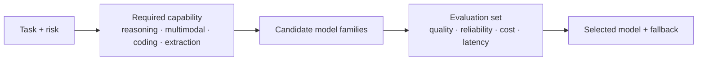
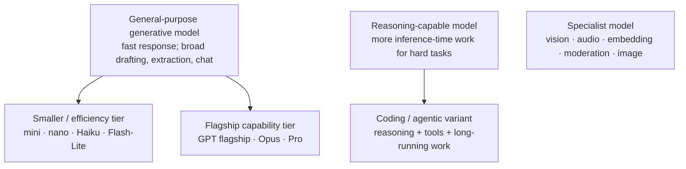
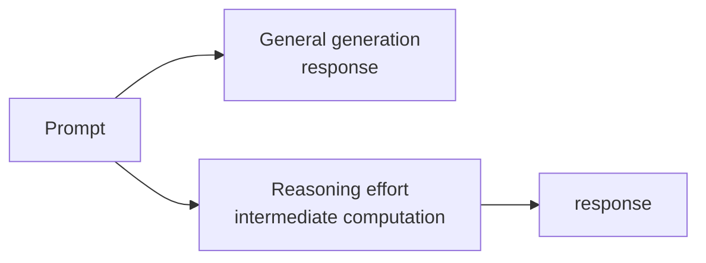
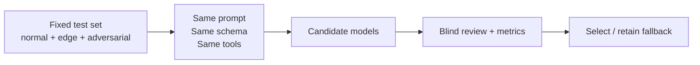
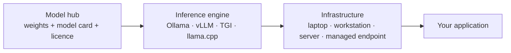
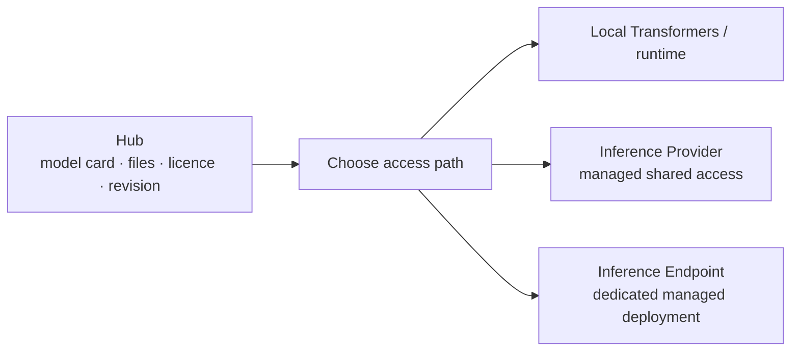
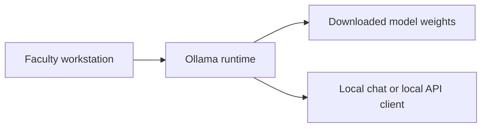
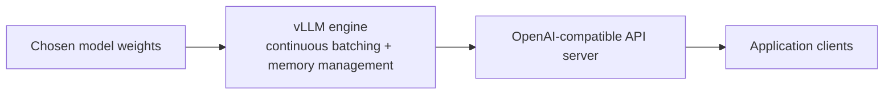

# Hands-on with LLMs: Model Families, Selection, and Open Models

## Chapter purpose

The previous chapter explained how a prompt shapes a model’s request-time context. This chapter answers the next practical question:

> **Which model should we use for this task—and how do we know?**

ChatGPT, Claude, Gemini, and open-source models are not four interchangeable chatbots. Each exposes model families with different capability, reasoning effort, latency, cost, context, modality, tool support, and deployment options.



---

## Slide 1 — A provider is not a single model

### On slide

| Provider ecosystem | Current family pattern | What the names usually signal |
| --- | --- | --- |
| **OpenAI** | GPT flagship / mini / nano; GPT reasoning and coding variants; specialized media and embedding models | capability tier, speed/cost tier, reasoning or task specialization |
| **Anthropic** | Claude Opus / Sonnet / Haiku | highest capability / balance / speed and cost efficiency |
| **Google** | Gemini Pro / Flash / Flash-Lite; Live, media, embedding, and agent models | deeper capability / low-latency workhorse / high-throughput efficiency / specialization |
| **Open model ecosystem** | Llama, Qwen, Gemma, Mistral, DeepSeek, gpt-oss, and many task-specific derivatives | weights, licence, hardware fit, modality, and runtime compatibility vary by model |

> The product name is a surface. Select a specific, versioned model underneath it.

### Speaker notes

“Use ChatGPT” is not a model-selection decision. It might mean a general GPT model in a chat product, a reasoning-capable GPT model through an API, or a specialist model for audio, images, embeddings, or coding. The same distinction applies to Claude and Gemini.

Model aliases can move. For production, record the exact model identifier or pinned snapshot, provider region/endpoint where relevant, date, and configuration. Treat a `latest` alias or preview model as a deliberate trade-off, not an invisible default.

---

## Slide 2 — Model series: the useful mental map

### On slide



| Naming pattern | Do not infer | Usually investigate |
| --- | --- | --- |
| **mini / nano / Haiku / Flash-Lite** | “low quality” or “only for demos” | latency, cost, throughput, and whether the task is well-defined |
| **Pro / Opus / flagship** | correctness without evaluation | hard reasoning, rich coding, complex multimodal work, long-context tasks |
| **reasoning / thinking / effort** | a proof or source of truth | whether extra inference-time computation improves this specific task |
| **realtime / live** | general-purpose depth | voice, streaming, and interactive latency |

### Speaker notes

Provider naming is not standardized. “Mini” and “Haiku” are product labels, not fixed parameter counts or capability guarantees. A smaller model can be the correct production model for high-volume classification, extraction, routing, or drafting when a larger model does not produce a measurable improvement.

Separate **model capability** from **product capability**. A chat surface might offer web search, code execution, file handling, memory, or agents; these are system features around the model and can change the effective workflow substantially.

---

## Slide 3 — Generative versus reasoning models

### On slide

| General-purpose generative model | Reasoning-capable model |
| --- | --- |
| predicts a response directly from the supplied context | is configured or trained to spend more inference-time effort on difficult problems |
| good fit: drafting, summarisation, extraction, classification, straightforward code | good fit: multi-step planning, difficult code/debugging, quantitative or constraint-heavy tasks |
| optimise: latency, cost, schema fidelity, throughput | optimise: task accuracy, tool use, reliability of intermediate decisions |



> Reasoning is a cost–latency trade-off. It is not an authority guarantee.

### Speaker notes

All of these systems generate tokens. A “reasoning model” generally allocates more computation or uses a reasoning-oriented training/inference regime before producing an answer. This can help on hard multi-step tasks, but it raises latency and cost and can still hallucinate, misread a source, or violate a constraint.

Do not force every task onto a reasoning model. For the course-outcome extraction example, a structured general model plus schema validation may outperform a slower reasoning model on cost and throughput while meeting the same rubric. The only defensible choice is empirical.

---

## Slide 4 — When to use a small, balanced, flagship, or reasoning tier

### On slide

| Workload | Start with | Escalate when |
| --- | --- | --- |
| high-volume routing, tagging, simple extraction | mini / nano / Haiku / Flash-Lite | source fidelity or schema adherence misses the threshold |
| document transformation, structured drafting, ordinary coding | balanced general model | evaluation reveals complex reasoning or tool-use failures |
| difficult debugging, multi-step planning, deep analysis | reasoning-capable or flagship model | a smaller tier fails on a measured test set |
| image/audio/video or semantic retrieval | dedicated multimodal, media, or embedding model | the task requires a different modality, not simply a larger text model |

```text
Do not start at the most capable model.
Start at the least expensive model that meets the agreed quality and safety threshold.
```

### Speaker notes

This is a decision ladder, not a performance ranking. A small model should not be chosen merely because it is cheap; it should be chosen when it passes the same task-specific acceptance criteria. Conversely, do not choose a flagship model merely because it produces more impressive prose.

The cost of a model is not only input/output tokens. Include retries, tool calls, human correction time, queueing latency, infrastructure, and the cost of a wrong answer. A slower model that avoids an expensive manual review can be cheaper at system level.

---

## Slide 5 — Compare models with one task harness

### On slide



Record for every run:

```text
model ID · provider · date · region/endpoint · prompt version
system instructions · retrieval/tool state · temperature · schema
input/output tokens · latency · cost · result · evaluator score
```

### Speaker notes

Do not compare outputs from an evolving conversation. Use a frozen test set and fresh context. If a provider has tools enabled in one trial, either disable them everywhere or define a separate tool-augmented evaluation.

Blind scoring is useful: let reviewers score anonymous outputs before revealing the model. It reduces the tendency to treat polished language or a favoured brand as evidence of task correctness.

---

## Slide 6 — Evaluation has more than one axis

### On slide

| Axis | Example measure |
| --- | --- |
| **Task quality** | accuracy, source fidelity, rubric score, code tests |
| **Reliability** | valid-schema rate, variance across runs, abstention behaviour |
| **Operational fit** | p50/p95 latency, cost per accepted result, throughput |
| **Safety and governance** | data boundary, prompt-injection resilience, policy violations, auditability |
| **User experience** | language quality, accessibility, multilingual performance, review burden |

> A leaderboard score is evidence about a benchmark—not proof of suitability for your workflow.

### Speaker notes

Use a small representative evaluation set first. Include routine cases, difficult boundary cases, malformed inputs, prompt-injection attempts when relevant, and examples in the languages your users actually use. For a faculty workflow, source fidelity and human-review time often matter more than generic benchmark performance.

The test set should grow from production failures. Every important failure becomes a regression case before changing the model, prompt, retrieval index, or serving runtime.

---

## Slide 7 — Provider families: current examples, not permanent labels

### On slide

| Ecosystem | Examples to recognise | Practical interpretation |
| --- | --- | --- |
| **OpenAI** | GPT-5 family, GPT-5 mini/nano, GPT-4.1, o-series reasoning, Codex, gpt-oss | general, efficiency, non-reasoning, reasoning, coding, and open-weight paths coexist |
| **Claude** | Opus, Sonnet, Haiku; optional thinking/effort controls where available | choose capability, balanced speed, or fastest tier; confirm current model snapshot and capabilities |
| **Gemini** | Pro, Flash, Flash-Lite; Live; embedding; media models | choose capability, low-latency/high-throughput, realtime, retrieval, or modality-specific paths |
| **Open models** | Llama, Qwen, Gemma, Mistral, DeepSeek, gpt-oss | choose exact checkpoint, licence, quantisation, context support, and serving engine |

### Speaker notes

Use this as a vocabulary map—not a procurement table. Current official documentation should be checked before a session or deployment. For example, OpenAI’s catalog distinguishes GPT flagship, mini/nano, reasoning, coding, media, embedding, and open-weight options; Anthropic’s catalogue distinguishes Opus, Sonnet, and Haiku; Gemini’s catalogue distinguishes Pro, Flash, Flash-Lite, Live, media, tool/agent, and embedding models.

The correct comparison is always **specific model ID versus specific model ID**, on your task and budget. Do not compare a current hosted flagship against an old or heavily quantised open checkpoint and call the result a hosted-versus-open conclusion.

---

## Slide 8 — The same request through three hosted provider SDKs

### On slide

Use an environment variable or secret manager for keys. Replace the model placeholder with a currently available, pinned model ID.

```python
# OpenAI — Responses API
from openai import OpenAI

client = OpenAI()
response = client.responses.create(
    model="<OPENAI_MODEL_ID>",
    input="Extract the stated course outcomes as JSON."
)
print(response.output_text)
```

```python
# Anthropic — Messages API
from anthropic import Anthropic

client = Anthropic()
message = client.messages.create(
    model="<CLAUDE_MODEL_ID>", max_tokens=1024,
    messages=[{"role": "user", "content": "Extract the stated course outcomes as JSON."}]
)
print(message.content[0].text)
```

```python
# Gemini — Google Gen AI SDK
from google import genai

client = genai.Client()
response = client.models.generate_content(
    model="<GEMINI_MODEL_ID>",
    contents="Extract the stated course outcomes as JSON."
)
print(response.text)
```

### Speaker notes

The three snippets intentionally do the same small task. The request/response objects differ, but the engineering questions remain the same: exact model ID, system/developer instructions, prompt contents, structured output mode, tool state, timeout, retry policy, usage recording, and validation.

Do not paste API keys into notebooks, slides, source code, or prompts. Keep credentials server-side, use environment variables or a secret manager, and give keys the minimum access and spending scope required.

---

## Slide 9 — Open-model access: Hub, local runtime, and serving engine

### On slide

```python
# Hugging Face: call a selected hosted/provider model
from huggingface_hub import InferenceClient

client = InferenceClient(api_key="<HF_TOKEN>")
result = client.chat.completions.create(
    model="<HUB_MODEL_OR_PROVIDER_MODEL_ID>",
    messages=[{"role": "user", "content": "Extract the stated course outcomes as JSON."}]
)
print(result.choices[0].message.content)
```

```bash
# Ollama: run an explicitly local model, then call its local chat API
ollama run <MODEL_TAG>

curl http://localhost:11434/api/chat \
  -d '{"model":"<MODEL_TAG>","messages":[{"role":"user","content":"Extract the stated course outcomes as JSON."}],"stream":false}'
```

```bash
# vLLM: serve selected weights, commonly through an OpenAI-compatible endpoint
vllm serve <HUGGING_FACE_MODEL_ID>
```

```python
# vLLM client: same OpenAI SDK shape, different base URL
from openai import OpenAI
client = OpenAI(base_url="http://localhost:8000/v1", api_key="unused")
response = client.chat.completions.create(
    model="<SERVED_MODEL_ID>",
    messages=[{"role": "user", "content": "Extract the stated course outcomes as JSON."}]
)
print(response.choices[0].message.content)
```

### Speaker notes

These examples show three distinct layers. Hugging Face helps discover and access model artifacts or managed inference; Ollama runs a selected model locally and exposes a local API; vLLM is a server-side inference engine for efficient, concurrent serving. A local API can make application code look similar to a hosted API, but it does not make the models behaviourally equivalent.

Never use an unreviewed Hub model directly with production data. Inspect the model card, licence, revision, publisher, tokenizer and any custom-code requirement. Confirm whether an Ollama tag is local or cloud-backed, and secure any vLLM endpoint before it is reachable by other users or services.

---

## Slide 10 — Open source, open weights, and the model supply chain

### On slide



| Term | Meaning |
| --- | --- |
| **Open-weight** | weights are available under a licence; this does not necessarily mean all training data or code are open |
| **Model card** | intended use, limitations, evaluation, licence, and sometimes safety information |
| **Quantisation** | lower-precision representation to reduce memory and cost; may affect quality or supported hardware |
| **Inference engine** | software that loads weights, manages memory/batching, and serves generation requests |

### Speaker notes

“Open source model” is often used loosely. Check the exact checkpoint licence, acceptable use, redistribution terms, model card, and origin. Also check whether a downloaded model will run locally, whether a runtime silently routes a request to a cloud model, and whether the serving environment is actually inside the data boundary you intend.

Hugging Face is primarily a hub and ecosystem for discovering, versioning, evaluating, and deploying model artifacts. Ollama is a convenient local runtime for interactive use and local APIs. vLLM is a high-throughput serving engine commonly used to expose models through an OpenAI-compatible API. They occupy different layers of the stack.

---

## Slide 11 — Hugging Face: discover, inspect, run, or deploy

### On slide



Checklist before selecting a Hub model:

- exact revision and licence;
- modality, context limit, language coverage, and intended task;
- parameter size and quantised artifacts;
- model-card evaluation versus your own test set;
- trust level of the publisher and any custom code requirement.

### Speaker notes

The Hub is not a quality guarantee. A download count, a chat demo, or a benchmark graphic is not enough for a production choice. Read the model card and inspect the repository. Pin a revision rather than relying on a moving branch.

Hugging Face’s managed Inference Endpoints combine model weights, an inference engine such as vLLM/TGI, and managed infrastructure. This is a deployment option, not the same thing as running a model on your own laptop.

---

## Slide 12 — Ollama: local experimentation and a local API

### On slide

```bash
# retrieve and run a chosen model locally
ollama run <model-tag>

# application-facing local API (default endpoint)
http://localhost:11434/api
```



Use it for:

- quick local model comparison;
- prototypes with explicitly local models;
- reproducible model tags in a classroom;
- testing the same prompt against hosted and local candidates.

### Speaker notes

Ollama makes it convenient to run and call supported models, but “local” must be verified as an operational mode. Some runtimes also support cloud models or remote endpoints; confirm the selected model and network path before making a data-locality claim.

Record the exact model tag, quantisation, runtime version, machine type, and context configuration. A `q4` quantised checkpoint on a laptop is not equivalent to a full-precision or larger server deployment, even when the model family name is the same.

---

## Slide 13 — vLLM: high-throughput serving for applications

### On slide



```bash
vllm serve <model-id>
# then point an OpenAI-compatible client at the vLLM base URL
```

| Choose vLLM when | Plan for |
| --- | --- |
| many concurrent requests, GPU serving, application integration | GPU capacity, batching/latency tuning, auth, rate limits, observability, upgrades |
| API compatibility reduces application switching cost | compatibility is not identical behaviour or identical capability |

### Speaker notes

vLLM is not a model and not a model hub. It is a serving engine. It manages inference efficiently, including batching and memory-related optimisations, and can expose familiar API shapes to application clients.

Serving a local model through an OpenAI-compatible endpoint can simplify application code, but it does not make it equivalent to an OpenAI model. Tool calling, structured outputs, reasoning controls, tokenizer behaviour, limits, and safety behaviour must all be tested with the selected checkpoint and runtime.

---

## Slide 14 — A practical model-selection worksheet

### On slide

```text
Task: ___________________________________________
Risk if wrong: low / medium / high
Input modalities: text / image / audio / video / files
Languages: _______________________________________
Required output: free text / schema / code / tool call
Quality threshold: ________________________________
Latency budget: ___________________________________
Cost budget: ______________________________________
Data boundary: ____________________________________
Candidates: _______________________________________
Evaluation set + rubric: __________________________
Fallback / human review: __________________________
```

> Select the smallest, least expensive model that passes the full acceptance threshold—and retain a tested fallback for failures.

### Speaker notes

The worksheet prevents model selection from collapsing into a brand preference. It forces the project to define risk, input modality, languages, operational constraints, data boundary, and a measurable quality threshold before a provider is chosen.

The next chapter, LLM Integration, turns the selected model into an application component: API boundary, prompt assembly, structured output validation, retrieval, tools, monitoring, and fallback routing.

---

## Slide 15 — Request parameters are part of model behaviour

### On slide

| Control family | Common parameters | What they change |
| --- | --- | --- |
| **Sampling** | `temperature`, `top_p`, `top_k`, `seed` | diversity and repeatability of token selection |
| **Output budget** | `max_tokens`, `max_output_tokens`, `stop` | maximum length and completion boundary |
| **Reasoning** | `effort`, `thinking`, `thinkingLevel`, reasoning-token budget | amount or depth of inference-time reasoning where supported |
| **Output contract** | JSON schema, response MIME type, structured-output mode | syntactic shape of the response |
| **Tools** | tool choice, allowed tools, parallel tool calls | whether and how the model can call external capabilities |
| **Runtime** | stream, timeout, retries, context limit, batch size | responsiveness, resilience, and throughput |

```python
# Illustrative configuration: exact fields vary by provider and model
config = {
  "max_output_tokens": 800,
  "temperature": 0.2,
  "seed": 42,
  "response_schema": OUTCOME_SCHEMA,
}
```

### Speaker notes

The prompt is only one input to the behaviour of an LLM system. A model, its version, decoding configuration, tool state, and runtime all affect the output. Record these beside the prompt whenever you evaluate or deploy a workflow.

Do not blindly set every parameter. Some current reasoning-oriented models restrict or reject non-default sampling controls. For example, recent Claude Opus/Sonnet generations use adaptive thinking and reject non-default `temperature`, `top_p`, and `top_k`; Gemini exposes sampling, seed, output budget, thinking, tools, and structured-output controls, while recommending default sampling for Gemini 3.x. Always consult the selected model’s current API reference.

---

## Slide 16 — Parameter choices should follow the task

### On slide

| Task | Sensible starting configuration | Verify |
| --- | --- | --- |
| extraction / classification | low variability where supported; schema; bounded output | source fidelity and valid schema rate |
| creative ideation | controlled diversity; generate several candidates | rubric-based selection, not the first answer |
| hard reasoning | model-supported effort/thinking; adequate output budget | task accuracy, latency, and total token cost |
| tool workflow | explicit allowed tools and validation | tool arguments, permissions, and side effects |

> A lower temperature does not make a response factual. A seed does not guarantee reproducibility across model or platform changes.

### Speaker notes

Temperature reshapes the sampling distribution; it does not make the model consult evidence. `top_p` and `top_k` are alternative sampling restrictions and are normally tuned deliberately rather than all at once. `max_output_tokens` is an output ceiling, not a quality target—too low can truncate a correct response.

For model comparisons, hold configuration fixed wherever capabilities allow. If two providers expose different controls, record the difference rather than pretending the trials are identical. Re-run the acceptance test after a model or configuration change.

---

## Sources used for this chapter

- [OpenAI — Model catalogue](https://platform.openai.com/docs/models)
- [OpenAI — Developer quickstart](https://developers.openai.com/api/docs/quickstart)
- [Anthropic — Claude models overview](https://platform.claude.com/docs/en/about-claude/models/overview)
- [Anthropic — Get started with Claude](https://platform.claude.com/docs/en/get-started)
- [Google — Gemini model catalogue](https://ai.google.dev/gemini-api/docs/models)
- [Google — Gemini API getting started](https://ai.google.dev/gemini-api/docs/get-started)
- [Hugging Face — Inference on servers and local endpoints](https://huggingface.co/docs/huggingface_hub/en/guides/inference)
- [Hugging Face — About Inference Endpoints](https://huggingface.co/docs/inference-endpoints/en/about)
- [Ollama — Quickstart](https://docs.ollama.com/quickstart)
- [Ollama — Chat API](https://docs.ollama.com/api/chat)
- [vLLM — Quickstart](https://docs.vllm.ai/en/latest/getting_started/quickstart/)
- [Anthropic — API usage primer and adaptive thinking](https://platform.claude.com/docs/en/claude_api_primer)
- [Google — Generation configuration reference](https://ai.google.dev/api/generate-content)
