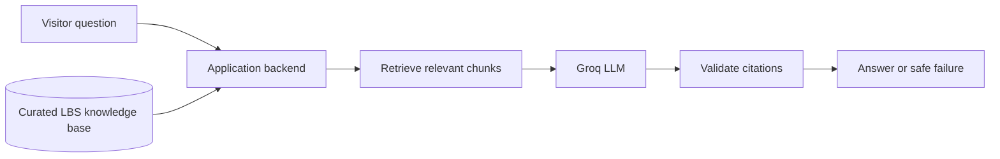
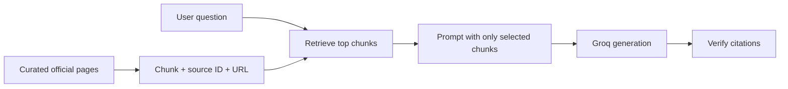
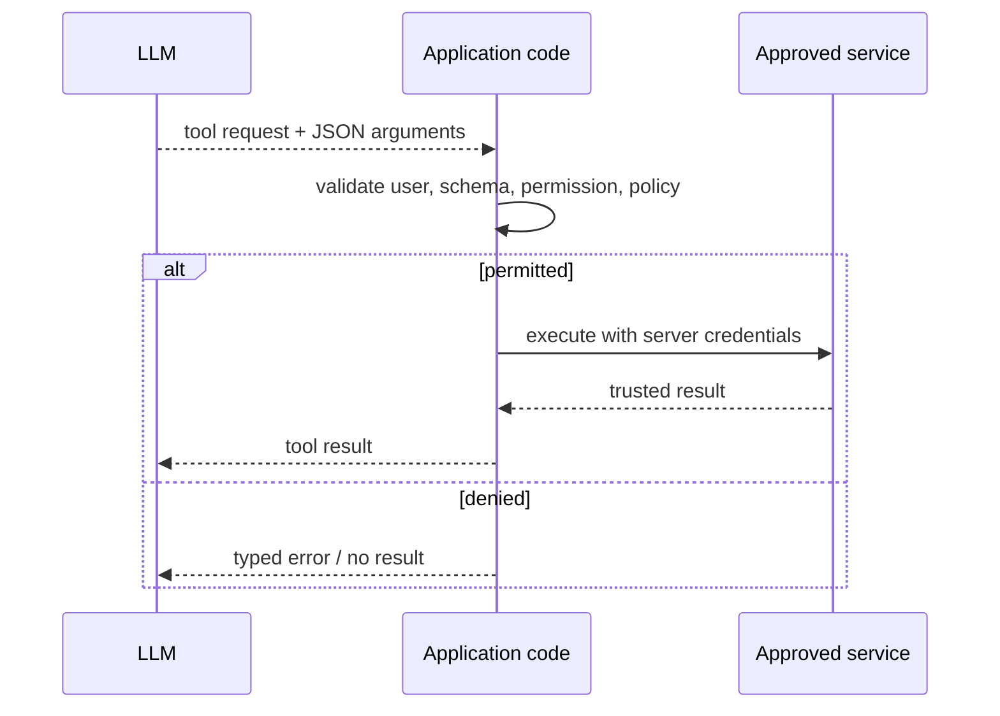

# APIs, SDKs, and practical LLM integration patterns

## Chapter outcome

Learn the application patterns behind **LLM Integration** through an LBS College knowledge-assistant demo. The demo retrieves relevant source chunks before it calls a hosted Groq model, then returns an answer with citations to the retrieved chunks.

The demo deliberately uses a small lexical retriever rather than a vector database: it keeps the complete Retrieval-Augmented Generation (RAG) path visible in one Python file. The architecture is the same when the retriever is later replaced by embeddings, hybrid search, or a database.

---

## Slide 1 — The problem statement

### On slide

> Build a read-only assistant that can answer approved questions about **LBS College of Engineering**.

Example questions:

- Which undergraduate programmes are offered?
- Where is the college located?
- What does the Career Guidance Cell do?
- Which departments are listed on the college website?

The answer must be grounded in retrieved official chunks, cite them, and say when the approved knowledge base does not contain enough evidence.

### Speaker notes

This is not a chatbot trained on everything about the college. It is an application that uses a selected, versioned knowledge base. That gives us a practical answer to three important questions: what information may the model use, how can the answer be checked, and what should happen when the information is missing?

---

## Slide 2 — The application owns the authority

### On slide

> The model can interpret language. The **application** owns source selection, permissions, retrieval, validation, tool execution, and the user experience.



### Speaker notes

The LLM is never the source of truth. The application chooses the specific knowledge chunks that enter the prompt and checks every source ID returned by the model. The API key also stays on the backend, never in the browser.

---

## Slide 3 — One question. One trusted source. One measurable contract

### On slide

**Question:** Which undergraduate programmes are offered at LBS College of Engineering?

**Trusted source:** selected chunks derived from official LBS College pages.

```json
{
  "answer": "The retrieved programmes page lists ...",
  "citations": ["programmes-2026"],
  "needs_human_help": false
}
```

> A clean-looking answer without an approved citation is not a valid application result.

### Speaker notes

This contract makes the assistant testable. We can evaluate whether it retrieves the correct chunks, whether citations are from those chunks, whether it correctly asks for human help when the corpus is insufficient, and whether the answer is useful to a visitor.

---

## Slide 4 — Current, scoped evidence before generation

### On slide



> **RAG = retrieve evidence, then generate with it.** A vector database is optional infrastructure, not the definition.

### Speaker notes

The demo uses deterministic lexical retrieval: it scores overlap between question words and each curated chunk, then keeps the top matching chunks. That is intentionally simple. It lets the audience inspect the entire retrieval step before discussing embeddings. A production deployment may replace this function with hybrid search or semantic retrieval, but it must still preserve source IDs and access control.

---

## Slide 5 — LLM integration: Groq through the OpenAI wrapper

### On slide

```python
from openai import OpenAI

client = OpenAI(
    api_key=os.environ["GROQ_API_KEY"],
    base_url="https://api.groq.com/openai/v1",
)

response = client.chat.completions.create(
    model="openai/gpt-oss-20b",
    messages=messages,
    temperature=0.1,
    response_format=ANSWER_SCHEMA,
)
```

### Speaker notes

Groq is the hosted inference provider; the OpenAI Python library is simply the client. The model identifier belongs in an environment variable in a real application, and every model or parameter change should be evaluated against the same retrieval-and-answer test cases.

---

## Slide 6 — The output we are looking for

### On slide

```python
ANSWER_SCHEMA = {
  "type": "json_schema",
  "json_schema": {
    "name": "lbs_college_answer",
    "strict": True,
    "schema": {
      "type": "object",
      "required": ["answer", "citations", "needs_human_help"],
      "additionalProperties": False
    }
  }
}
```

```python
permitted = {chunk["source_id"] for chunk in retrieved_chunks}
if not set(answer["citations"]) <= permitted:
    raise ValueError("The model cited an unretrieved source")
```

### Speaker notes

Strict structured output ensures a schema-conforming JSON object for supported Groq models. This removes one failure class—malformed shape—but not unsupported facts. The second check is the important RAG boundary: cited IDs must come from the chunks retrieved for this request, not from a model guess.

---

## Slide 7 — The model can request. Only code can act.

### On slide

> The LBS Assistant is read-only. If it later gains tools, each tool call remains a proposal until application code validates and performs it.



### Speaker notes

For example, a future assistant could propose a `find_admission_contact` tool. It cannot send email, edit a public page, or access a student record by itself. The backend decides which named tools exist, validates every argument, checks the caller’s permissions, and records the resulting action.

---

## Slide 8 — Walk through the code, then change it

### On slide

```text
1. lbs_knowledge_base.json  → curated official chunks
2. retrieve(question)       → rank and select evidence
3. build_messages()         → evidence + instructions + question
4. answer_lbs_question()    → Groq request
5. validate_answer()        → citation boundary
6. /api/ask                 → UI endpoint
```

```bash
cd docs/demo
python3 -m pip install openai python-dotenv
```

Create `docs/demo/.env` (it is already ignored by Git):

```dotenv
GROQ_API_KEY=gsk_your_key_here
GROQ_MODEL=openai/gpt-oss-20b
```

```bash
python3 policy_assistant_demo.py
# Open http://127.0.0.1:8080
```

### Speaker notes

Start the walkthrough with the JSON knowledge base. Every record has a source ID, title, official URL, and text chunk. Next, show the `retrieve` function: it runs before the model call. Then show prompt construction, the OpenAI-compatible Groq call, and finally the code that rejects citations outside the retrieved set.

For a live modification, add a new official source chunk; ask a question that should retrieve it; then deliberately ask an unsupported question and observe the safe failure path. Once that is clear, replace the lexical retriever with embeddings as the next iteration.

---

## Slide 9 — Audience lab: change one variable

### On slide

| Activity | Change | Observe |
|---|---|---|
| Prompt contract | Update `SYSTEM_INSTRUCTIONS` to require a two-line answer, one citation, and an evidence-missing refusal. | Prompting changes the current request, not the learned parameters. |
| Few-shot examples | Add one grounded answer and one unsupported-question refusal to `build_messages()`. | Examples demonstrate a response pattern at runtime. |
| Temperature + model | Run the same questions at `0.0`, `0.3`, `0.8`; then change `GROQ_MODEL` in `.env`. | Compare stability, latency, wording, and structured-output behaviour. |
| Retrieval grounding | Ask an unsupported question; add one approved source chunk; ask again. | RAG extends factual scope only when relevant evidence is retrieved. |

Every group reports one success, one failure, the changed code, and whether citations remained within the retrieved source IDs.

### Speaker notes

Do not let teams change every variable at once. They should start from the same code and use the same test questions. This makes the experiment interpretable: variation might come from prompting, sampling, model selection, or retrieval—not from an uncontrolled mixture of all four.

---

## Slide 10 — Shared evaluation set

### On slide

1. Which undergraduate programmes are offered at LBS College of Engineering?
2. Where is the college located?
3. Does the college offer a B.Tech programme in Biomedical Engineering?
4. What is the hostel fee?
5. Which support does the Career Guidance Cell provide?

Record for every run: answer usefulness, returned citations, and `needs_human_help`.

> Questions 3 and 4 are boundary tests. When the approved knowledge base has no evidence, uncertainty is the correct result.

### Speaker notes

Questions 1, 2, and 5 test supported information. Questions 3 and 4 test whether the application declines to invent details. Ask every group to run the same set before and after its single change, then discuss both the strongest answer and the most useful refusal.

---

## Slide 11 — The integration mental model

### On slide


> Build the knowledge boundary first. Let the model work inside it. Let code decide whether the result is usable.

---

## Sources

- [LBS College: About](https://lbscek.ac.in/college/)
- [LBS College: Programmes](https://lbscek.ac.in/programs/)
- [LBS College: Departments](https://lbscek.ac.in/departments/)
- [LBS College: Contact](https://lbscek.ac.in/contact-2/)
- [LBS College: Career Guidance Cell](https://lbscek.ac.in/career-guidance-cell/)
- [Groq: OpenAI compatibility](https://console.groq.com/docs/openai)
- [Groq: Structured outputs](https://console.groq.com/docs/structured-outputs)
