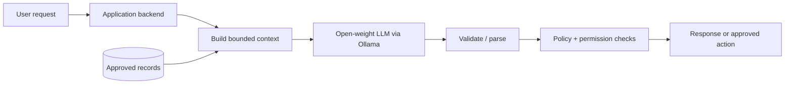
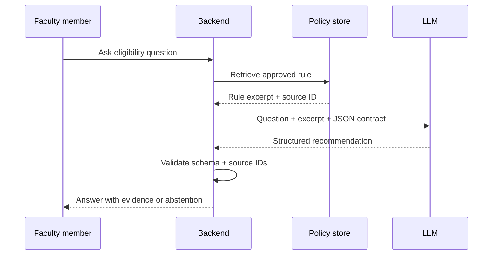
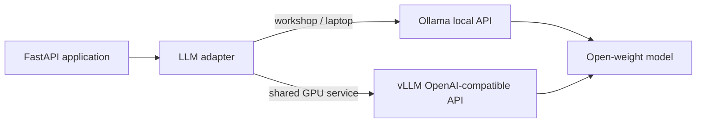
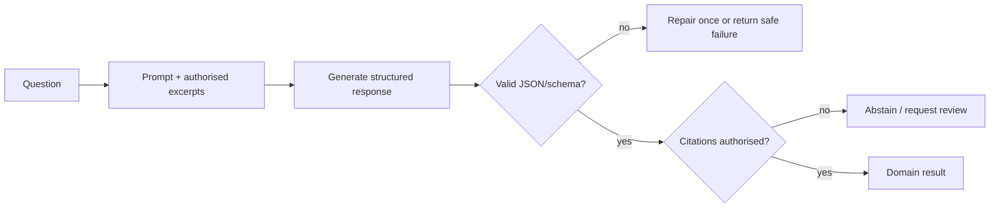
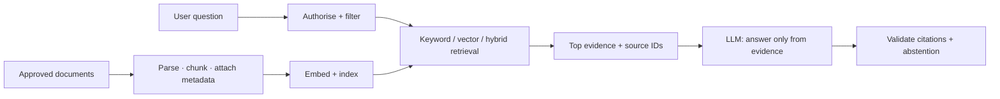
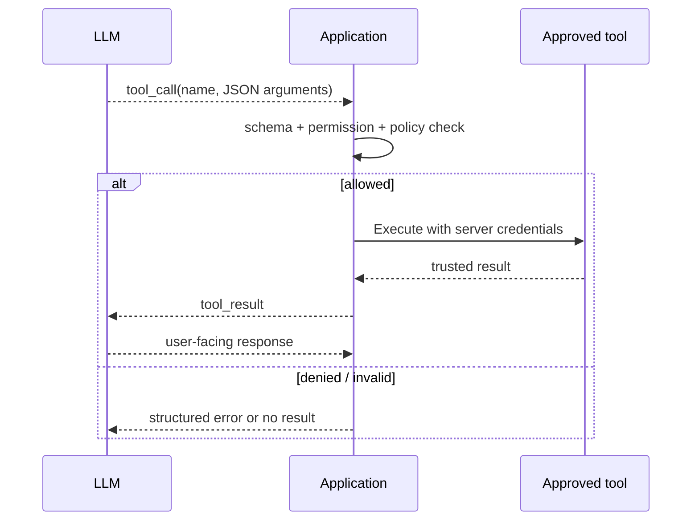
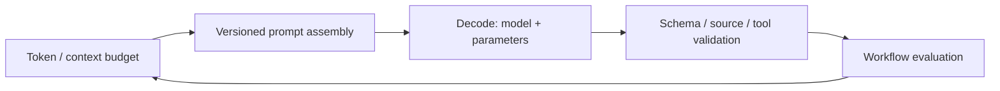
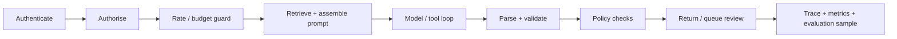
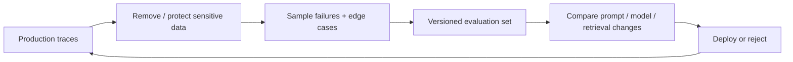

# Integrating LLMs in Applications

## Chapter outcome

An LLM integration is not “send a prompt, display text.” It is an application boundary around a probabilistic component: the application decides what data enters the context, what actions are permitted, what shape the result must have, and what happens when the model is uncertain or fails.

Running example: a **faculty course-policy assistant** using a local open-weight model through **Ollama**. It answers questions from approved regulations, drafts a structured recommendation, and never changes any record without explicit application-side approval. The same application adapter later points to a **vLLM** server for shared, higher-throughput deployment.

---

## Slide 1 — The model is one component, not the application

### On slide

> **Application = deterministic system + bounded model behaviour**

The application owns identity, permissions, source data, validation, side effects, and the user experience. The model contributes interpretation and generation inside those boundaries.



### Speaker notes

This distinction prevents a common mistake: attaching an API key to a frontend and treating the returned prose as an application result. The LLM should not independently decide what records it may see, what API it may call, or whether a generated answer is safe to persist.

The course-policy assistant illustrates the division. The backend authenticates the faculty member, retrieves only regulations they may view, asks a local Ollama-served model to reason over those sources, validates the response format, and presents a recommendation with citations. A separate deterministic workflow handles any actual policy change.

---

## Slide 2 — Build one thin vertical slice first

### On slide

> Start with one user outcome, one trusted source, one measurable contract.

**Question:** “Can a student with 72% attendance sit for the examination?”  
**Trusted source:** approved attendance regulation.  
**Contract:** `eligible | ineligible | insufficient_evidence`, with cited source sections.



### Speaker notes

A thin vertical slice proves the whole chain: data access, prompting, output handling, and evaluation. It is more useful than building a general chat interface with no clear correctness condition.

The word **abstention** matters. `insufficient_evidence` is a valid system result, not an error. It is safer than asking the model to sound confident when no authorised source supports the answer.

---

## Slide 3 — One adapter, two open-model deployment paths

### On slide



```python
from openai import OpenAI

def open_model_client(base_url: str) -> OpenAI:
    return OpenAI(base_url=base_url, api_key="local-or-server-key")

# laptop:  http://localhost:11434/v1
# vLLM:    http://llm-server:8000/v1
client = open_model_client(MODEL_BASE_URL)
```

> The application calls its own adapter. The adapter hides the serving endpoint and model-specific request details.

### Speaker notes

Ollama is a useful workshop runtime because it downloads/runs a selected model tag locally and exposes a local API. It makes the complete path inspectable: the model, the runtime, and the application are all visible. The model tag, quantisation, and local hardware still matter; local does not automatically mean fast, private in every respect, or suitable for every workload.

vLLM is the scale-out path: a server hosts a chosen Hugging Face model and exposes an API that can be compatible with OpenAI client conventions. The application should not be rewritten for this move. Change the adapter configuration, pin the model and runtime versions, then evaluate the new deployment on the same workflow test set.

---

## Slide 4 — API, SDK, and your integration boundary

### On slide

| Layer | Responsibility | Keep it stable? |
| --- | --- | --- |
| **Provider API** | remote model inference, tool protocol, usage metadata | provider-specific |
| **SDK** | typed client, authentication, streaming helpers, retries | provider-specific |
| **Your adapter** | app request → provider request; provider result → domain result | **yes** |
| **Domain service** | rules, retrieval, permissions, validation, user workflow | **yes** |

> Put provider-specific payloads behind a small adapter. Do not let UI components or domain rules depend directly on one SDK’s response object.

### Speaker notes

An API is the HTTP contract exposed by a service. An SDK is a language-specific library that makes that API easier to call. Neither is your application architecture.

The adapter is deliberately small. It accepts an application-owned request such as `AnswerPolicyQuestion` and returns an application-owned result such as `PolicyAnswer`. This keeps model switching, pinned model versions, instrumentation, and provider quirks in one place.

---

## Slide 5 — Define an application contract before prompting

### On slide

```python
class PolicyAnswer(BaseModel):
    decision: Literal["eligible", "ineligible", "insufficient_evidence"]
    rationale: str
    citations: list[str]
    requires_human_review: bool
```

> A schema constrains **shape**. Application validation still decides whether the content is trustworthy and permitted.

```python
def answer_policy(question: str, excerpts: list[Excerpt]) -> PolicyAnswer:
    messages = assemble_prompt(question, excerpts)  # versioned template
    response = client.chat.completions.create(
        model=MODEL_ID,
        messages=messages,
        temperature=0.1,
        max_tokens=400,
    )
    answer = PolicyAnswer.model_validate_json(response.choices[0].message.content)
    assert set(answer.citations) <= {item.source_id for item in excerpts}
    return answer
```

> For an open model, use the server’s structured-output mode when it is supported; otherwise parse defensively and take the safe-failure path on invalid output.



### Speaker notes

Natural-language formatting instructions such as “return JSON only” are weak contracts. Prefer a provider feature for structured outputs where it is available, then parse and validate the result inside the application. Structured output reduces malformed output; it does **not** prove that a cited policy exists, that the recommendation is correct, or that a request is authorised.

Keep the enum small and useful. A good contract includes an explicit uncertainty state rather than forcing the model to select a positive or negative answer.

---

## Slide 6 — Retrieval gives the model current, scoped evidence

### On slide

> **RAG is retrieval + generation, not a synonym for a vector database.**



**Retrieval quality determines generation quality.** Retrieve only documents the caller may access, preserve document and section identifiers, and evaluate retrieval separately from answer generation.

### Speaker notes

Retrieval-augmented generation grounds an answer in external, changing, or private information without putting all that information into model weights. The ingestion path matters: source documents are parsed, chunked, indexed, and tagged with metadata such as policy version, department, effective date, and access scope.

At query time, authorisation comes first. A highly relevant chunk that the user is not allowed to view must never enter the prompt. A hybrid retriever often combines exact keyword matching with semantic similarity; which works best is an evaluation question, not an article of faith.

---

## Slide 7 — Tools let the model request actions; code performs them

### On slide

> The model proposes a tool call. **Your application validates and executes it.**



Example tool declaration:

```json
{
  "name": "lookup_attendance_rule",
  "description": "Returns an approved attendance rule by programme and semester.",
  "parameters": {
    "type": "object",
    "properties": {
      "programme": {"type": "string"},
      "semester": {"type": "integer"}
    },
    "required": ["programme", "semester"],
    "additionalProperties": false
  }
}
```

### Speaker notes

Tool calling is sometimes called function calling. The provider supplies a protocol by which the model can emit a named function and JSON arguments. The model does not execute the function; the application receives the proposal, validates it, runs approved code with server-side credentials, and returns a result to the model if needed.

Treat tool arguments as untrusted input. Validate schema, authorise the caller, restrict each tool’s capability, set timeouts, and require confirmation for consequential actions. Never expose a generic database or shell tool merely because a model can call it.

---

## Slide 8 — Choose the pattern from the risk and workflow

### On slide

| Pattern | Model role | Deterministic boundary | Good first use |
| --- | --- | --- | --- |
| **Extract → validate** | turn unstructured input into typed fields | schema + business rules | form / document intake |
| **Retrieve → answer** | synthesise authorised evidence | retrieval + citations + abstention | policy / knowledge assistant |
| **Draft → review → publish** | produce a candidate artefact | human approval | feedback, summaries, course material |
| **Tool loop** | select and sequence narrow tools | allowlist + permission + confirmation | internal operational assistance |
| **Autonomous agent** | plan across multiple steps | budget, sandbox, approval, audit trail | only after a bounded pattern is reliable |

> Start with the narrowest pattern that delivers the user outcome.

### Speaker notes

“Agent” is not a required architecture. Most useful faculty and institutional applications begin as extraction, retrieval, or drafting workflows. These patterns have narrower failure modes and are far easier to evaluate.

Move toward a tool loop only when the model must decide among several allowed operations. Move toward autonomy only when you can state the action boundary, maximum cost, termination condition, recovery path, and human approval requirement.

---

## Slide 9 — Every earlier chapter now becomes application code

### On slide

| Earlier learning | It becomes this integration decision |
| --- | --- |
| **Language model / tokens** | input is tokenised; context window is budgeted, not infinite |
| **Transformer attention** | the model weights relevant tokens differently; evidence placement and retrieval quality therefore matter |
| **Prompt engineering** | versioned instructions, delimited trusted context, examples, output contract |
| **Temperature / decoding** | task-specific configuration: constrained extraction ≠ creative drafting |
| **Model selection** | exact model, quantisation, serving runtime, latency and cost are measured choices |
| **Evaluation** | test the complete workflow: retrieval, output validity, citations, tools, and human correction |



### Speaker notes

This is why the previous chapters were not separate topics. A context window creates a hard budget for instructions, conversation history, retrieved evidence, tool results, and the desired answer. Retrieval chooses what earns a place in that budget. Prompt design tells the model how to interpret those inputs. Temperature and related controls change decoding behaviour, not truthfulness. The application must validate the result afterward.

For the course-policy assistant, the prompt is a versioned template: system rules, explicitly delimited regulation excerpts with source IDs, the faculty question, a small schema, and a low-variability configuration. Changing any one of those is a workflow change to evaluate—not a harmless wording edit.

---

## Slide 10 — A production request is a pipeline, not a single call

### On slide



**Prompt assembly should be code.** Version system instructions, templates, retrieval settings, tool definitions, and output schema just as deliberately as application code.

### Speaker notes

The pipeline orders controls by cost and safety. Reject unauthorised requests before retrieval or generation. Rate limits and budget checks come before expensive model calls. Parse and validate the result before it reaches a user or downstream service.

Prompt assembly is not a text box hidden in a controller. It combines a versioned template with user input, trusted context, tool declarations, provider parameters, and model ID. Recording those versions is essential for debugging a changed result later.

---

## Slide 11 — Reliability: design for normal failure

### On slide

| Failure class | Design response |
| --- | --- |
| timeout / temporary provider error | bounded retry with exponential backoff and jitter |
| rate limit | queue, back off, reduce concurrency, surface wait state |
| invalid structured output | parse failure path; one constrained repair or safe failure |
| retrieval finds weak evidence | abstain, ask a clarifying question, or route to review |
| tool failure | return typed tool error; do not invent a success |
| model outage / budget exhaustion | known fallback model, degraded mode, or human workflow |

> A retry is appropriate for a transient transport failure—not for a wrong answer.

### Speaker notes

Use timeouts at every external boundary. A retry policy needs a limit, backoff, and jitter so a failure does not become a self-inflicted traffic spike. For side-effecting operations, use idempotency keys or a separate approval workflow so retrying cannot duplicate an action.

Do not silently fall back from a high-capability model to a smaller model for a high-risk decision. Fallback is a product decision: define when it is allowed, what quality threshold applies, and whether the user must be informed.

---

## Slide 12 — Safety is an integration property

### On slide

> Untrusted text can influence a model. It must not silently gain authority over your system.

| Threat | Boundary that reduces it |
| --- | --- |
| prompt injection in retrieved content | treat retrieved text as data; isolate it; constrain tools; validate actions |
| data leakage | authorise before retrieval; minimise context; segregate tenants; redact sensitive data |
| unsafe action | narrow tools; least privilege; confirmation; audit log |
| confident but unsupported claim | citations, source validation, abstention, human review |
| secret exposure | server-side keys; secret manager; never put privileged keys in a browser |

### Speaker notes

Prompt injection is not solved by adding a sentence such as “ignore malicious instructions.” A retrieved web page, document, or tool result is external input. It should be clearly separated from application instructions, should not be allowed to redefine tool permissions, and should be unable to bypass application-side checks.

Least privilege is especially important for tools. A course-policy assistant can read an approved regulation through a narrow service; it does not need unrestricted access to all institutional systems.

---

## Slide 13 — Observe the workflow, then evaluate it continuously

### On slide

```text
trace_id · request class · model ID · prompt/template version
retrieval IDs + scores · tool calls · schema outcome · latency
token usage · cost · fallback/retry · user feedback · rubric score
```

> Logs explain one request. Evaluation tells you whether the workflow is improving.



### Speaker notes

An LLM trace needs more than the final answer. To reproduce behaviour, capture the versioned configuration: model ID, template, parameter settings, retrieval corpus/version, documents selected, tools available, tool results, and validation outcome. Protect logs as potentially sensitive data.

Make production failures into regression cases. Evaluate the full workflow, not just the model in isolation: authorisation, retrieval accuracy, citation correctness, JSON validity, latency, cost, and the amount of human correction required.

---

## Slide 14 — Practical integration checklist

### On slide

1. State one user outcome and one measurable acceptance rule.
2. Keep the provider SDK behind an application-owned adapter.
3. Authenticate and authorise before assembling context.
4. Use typed outputs; validate semantics after parsing.
5. Ground changing/private facts through retrieval with source IDs.
6. Treat tool calls and tool results as untrusted protocol data.
7. Design timeouts, budgets, fallback, and abstention before launch.
8. Trace every versioned boundary; grow an evaluation set from failures.

> **The safest useful LLM application is usually a bounded workflow with a clear human escape hatch.**

### Speaker notes

This is the closing principle for the programme. Generative AI adds useful language understanding and generation, but dependable software still comes from explicit contracts, constrained capabilities, evidence, and feedback loops.

For a first institutional application, choose a high-value workflow that can be reviewed: extract information from a document, answer from a restricted policy corpus with citations, or draft a recommendation for human approval. Measure it before making it autonomous.

---

## Sources and further reading

- [OpenAI: Structured model outputs](https://developers.openai.com/api/docs/guides/structured-outputs) — schema-constrained outputs and SDK support.
- [OpenAI: Function calling](https://developers.openai.com/api/docs/guides/function-calling) — tool/function-call lifecycle.
- [Anthropic: Tool use overview](https://platform.claude.com/docs/en/agents-and-tools/tool-use/overview) — tool definitions and client-side execution loop.
- [Google: Function calling with Gemini](https://ai.google.dev/gemini-api/docs/function-calling) — function-call protocol and configuration.
- [Ollama: Quickstart](https://docs.ollama.com/quickstart) — local model runtime and API entry point.
- [vLLM: Tool calling](https://docs.vllm.ai/en/latest/features/tool_calling/) — open-model tool-calling support and parser/runtime considerations.
- [OWASP Top 10 for LLM Applications](https://genai.owasp.org/llm-top-10/) — prompt injection and other integration risks.
